# Day 2 Day Ledger

A comprehensive, offline-first business management application built for the coal trading industry. Day 2 Day Ledger replaces paper khatas and scattered spreadsheets with a single, secure Android app that handles party ledgers, inventory tracking, expense management, fleet maintenance, reminders, and notes -- all synced to the cloud when you choose.


---

## Table of Contents

- [Overview](#overview)
- [Screenshots](#screenshots)
- [Features](#features)
  - [Home Dashboard](#home-dashboard)
  - [Party Ledger](#party-ledger)
  - [Inventory and Stock](#inventory-and-stock)
  - [Expense Tracker](#expense-tracker)
  - [Vehicle Garage](#vehicle-garage)
  - [Notes and Folders](#notes-and-folders)
  - [Reminders](#reminders)
  - [Data Export](#data-export)
  - [Cloud Sync and Backup](#cloud-sync-and-backup)
  - [Security](#security)
- [Architecture](#architecture)
- [Tech Stack](#tech-stack)
- [Project Structure](#project-structure)
- [Getting Started](#getting-started)
- [Contributing](#contributing)
- [License](#license)

---

## Overview

Day 2 Day Ledger was built to solve a real problem: managing the daily financial operations of a coal trading business where transactions involve truck deliveries with weight, rate, and fare calculations, payments flow in both directions between buyers and suppliers, and inventory sits across multiple mines and warehouses.

The app works entirely offline using Room Database as the single source of truth. When a cloud account is connected, all data synchronizes to Firebase Firestore in real-time, enabling seamless backup and multi-device access.

---

## Screenshots

### Dashboard and Settings

| Home Dashboard | Settings (Cloud and Profile) | Settings (Security and Data) |
|:-:|:-:|:-:|
| 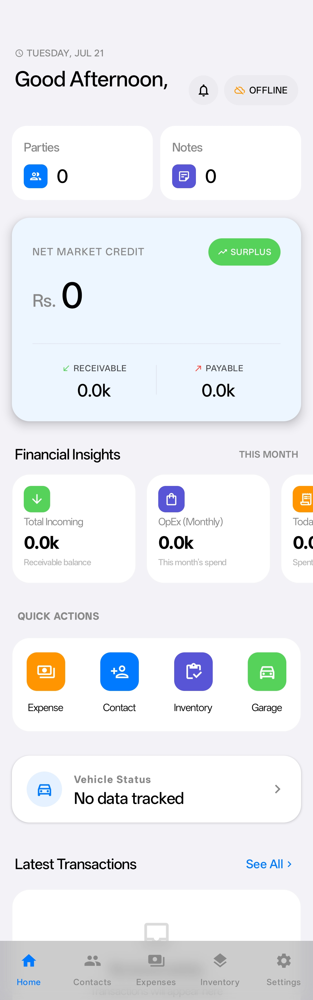 | 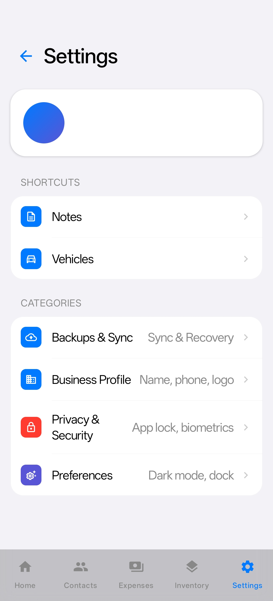 | 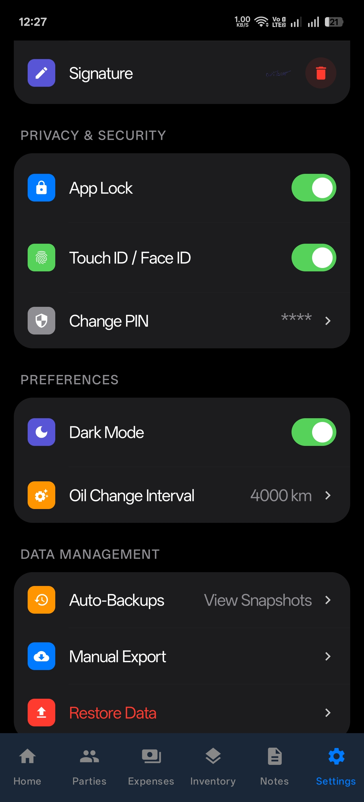 |

### Contacts and Expenses

| Parties / Contacts | Add New Party | Expense Tracker |
|:-:|:-:|:-:|
| 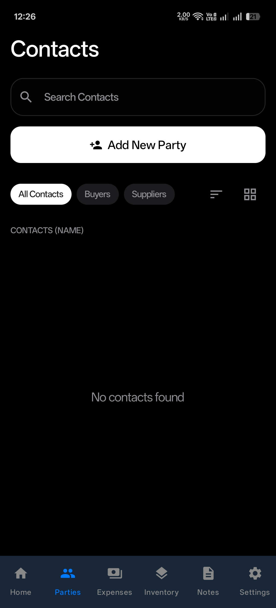 | 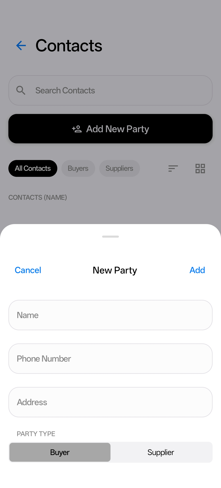 | 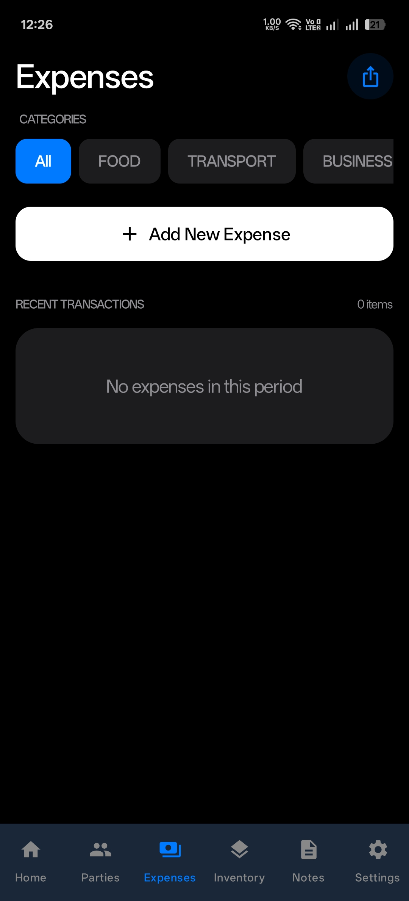 |

### Inventory and Notes

| Add New Expense | Inventory / Stock | Initialize Mine |
|:-:|:-:|:-:|
| 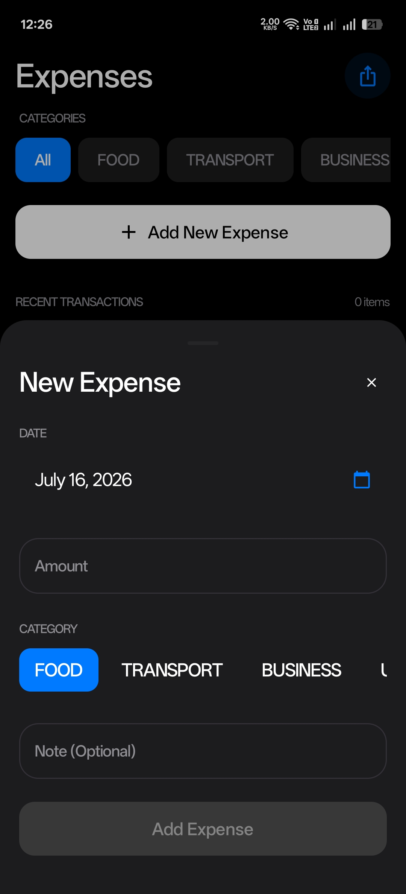 | 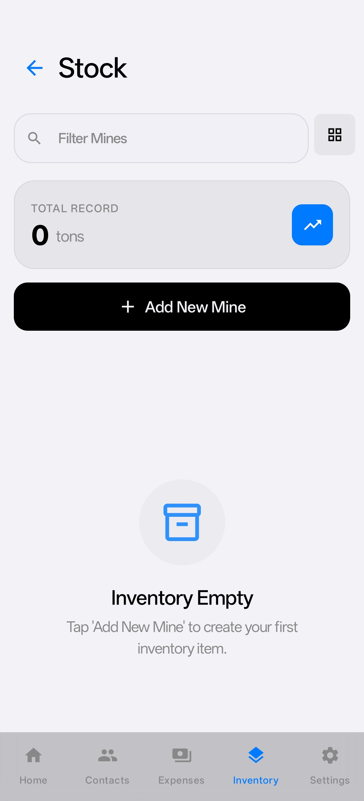 | 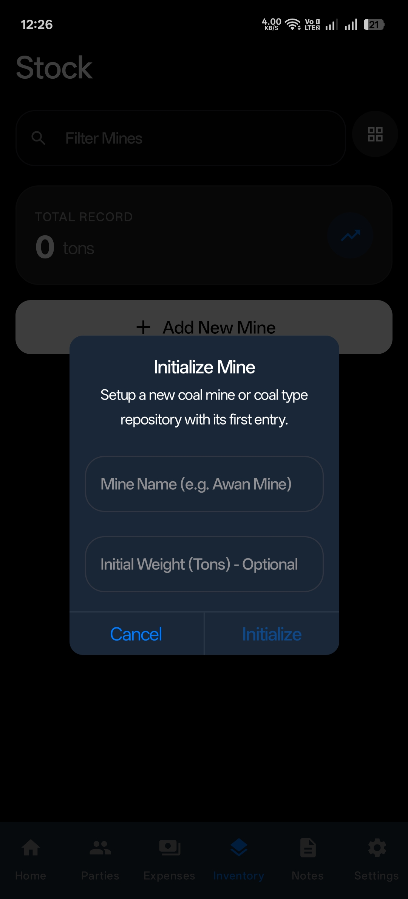 |

### Fleet and Notes

| Notes / Folders | Vehicle Garage | Add New Vehicle |
|:-:|:-:|:-:|
| 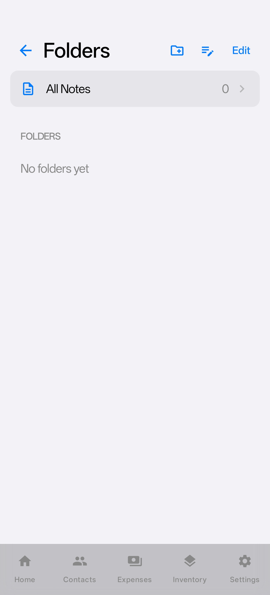 | 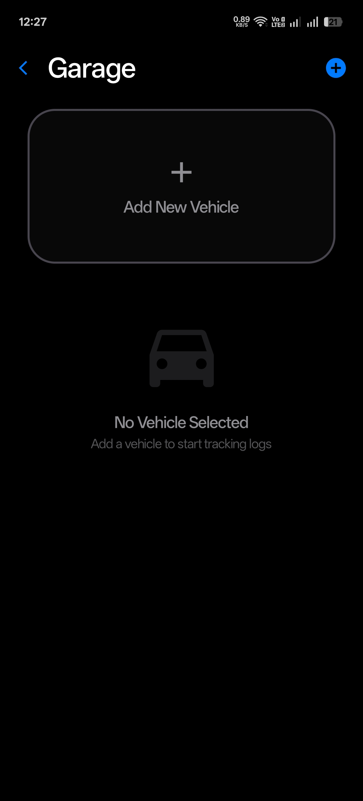 | 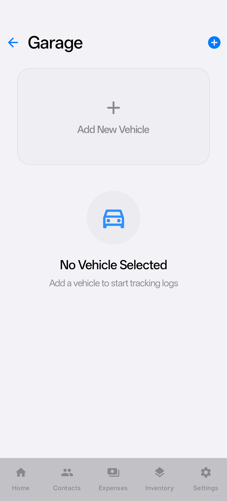 |

---

## Features

### Home Dashboard

The home screen greets the user by name with a time-aware greeting (Good Morning, Good Afternoon, Good Evening, Good Night) and displays the current date. It serves as the financial command center:

- **Net Market Credit** -- the difference between total receivables and total payables across all parties, with a Surplus/Deficit indicator.
- **Receivable and Payable** summaries calculated in real-time from all party ledgers.
- **Financial Insights** -- a horizontally scrollable row of cards showing Total Incoming, monthly OpEx (Operating Expenses), and today's spending.
- **Vehicle Status** -- km remaining until the next oil change for the primary vehicle.
- **Quick-access counters** for Parties, active Reminders, and Notes.
- **Recent Activity feed** -- the last 10 ledger entries and payments across all parties, each tappable for a full preview.
- **Pull-to-refresh** with sync status indicator (Synced, Syncing, Local Only, Error).

### Party Ledger

The core financial module. Parties are classified as either **Buyer** or **Supplier**, and each party has its own detailed ledger.

**Contacts Screen:**
- Search, filter by type (All / Buyers / Suppliers), and sort by Name, Balance, or Type.
- Toggle between list and grid view layouts.
- Add new parties with Name, Phone Number, Address, and Party Type.
- Swipe-to-edit and swipe-to-delete with haptic feedback.

**Ledger Detail Screen:**
- Color-coded header: green for Receivable, red for Payable.
- Displays the Net Balance in PKR with Receivable/Payable status badge.
- Two entry types:
  - **Ledger Entries** -- records of coal deliveries with fields for Truck Number, Mine, Warehouse, Weight (tons), Rate (per ton), Fare, and Advance Payment. The total is calculated as `(Weight x Rate) + Fare`.
  - **Payments** -- records of money exchanged, classified as "They Paid" or "I Paid".
- Balance logic:
  - For Buyers: `Truck Value - Their Payments + My Payments`
  - For Suppliers: `Truck Value - My Payments + Their Payments`
- Full transaction history with date-range filtered export to PDF and Excel.

### Inventory and Stock

Purpose-built for tracking coal across multiple mines and warehouses.

- **Mine Initialization** -- create a new mine (coal type repository) with a name and optional initial weight in tons.
- **Total Record** -- aggregate tonnage across all mines displayed prominently.
- **Per-mine tracking** -- each mine records individual stock entries with weight, warehouse, date, and notes.
- Peak weight tracking for historical reference.
- Search/filter mines and toggle between list and grid views.

### Expense Tracker

Track daily business and personal expenditures with category-based filtering.

- **Five categories**: Food, Transport, Business, Utilities, and Others.
- Each expense records an amount, date, category, and optional note.
- Filter view by category with a horizontally scrollable chip selector.
- Monthly and daily expense totals calculated automatically via the ViewModel.
- Export expenses to branded PDF documents.

### Vehicle Garage

A full fleet management module for business vehicles.

- **Multi-vehicle support** with a horizontal pager to swipe between vehicles.
- Vehicle profiles include Nickname, Plate Number, Type (Truck or Car), and Initial Odometer reading.
- Designate a primary vehicle for dashboard metrics.
- **Three tracking tabs**:
  - **Fuel Log** -- record mileage, liters, and amount per fill-up.
  - **Oil Change** -- track oil change maintenance events by mileage.
  - **Services** -- general maintenance entries with cost and description.
- **Calculated metrics**:
  - Average km/liter fuel efficiency computed across all fuel entries.
  - Monthly fuel and maintenance costs.
  - Fuel efficiency trend graph.
  - Km remaining until next oil change (configurable interval, default 4000 km).
  - Automatic alert when oil change is overdue or approaching.

### Notes and Folders

An integrated note-taking system with rich formatting capabilities.

- **Folder organization** -- create, rename, and delete folders to group notes.
- **Rich Note Editor** (1750+ lines of UI code):
  - Auto-save with 600ms debounce.
  - 50-level undo/redo history.
  - Adjustable font sizes (13 to 30sp in 6 steps).
  - Custom background colors and background image patterns.
  - Custom text colors.
  - Pin notes to the top of the list.
  - Share notes via Android's share sheet.

### Reminders

A business-oriented reminder system with alarm integration.

- **Priority levels**: None, Low, Medium, High -- with corresponding visual indicators.
- **Categories**: Payment, Delivery, Stock, Audit, Collection, Meeting, Personal, General.
- **Recurrence options**: None, Daily, Weekly, Bi-Weekly, Monthly, Yearly, Custom.
- Sub-task support via parent-child reminder relationships.
- Due date and time scheduling with native Android `AlarmManager` integration.
- **Exact alarms** on supported API levels with `setExactAndAllowWhileIdle`.
- **Snooze support** -- reminders can be snoozed with a configurable delay.
- Full notification delivery via `NotificationHelper` with alarm sounds managed by `AlarmSoundManager`.
- Active vs. Completed tabs with swipe-to-toggle completion.

### Data Export

Two independent export systems produce professionally formatted documents.

**PDF Export** (`ExportUtils.kt`):
- Native Android `PdfDocument` API -- no third-party PDF libraries.
- Multi-page support with automatic pagination.
- Branded headers with company logo and business name.
- Professionally styled transaction tables with alternating row colors.
- Opening balance calculation for date-range filtered reports.
- Signature block at the document footer.
- Color-coded amounts (green for receivable, red for payable).
- Share via Android's `FileProvider` intent system.

**Excel Export** (`XlsxWriter.kt`):
- Pure Kotlin OOXML writer using raw `ZipOutputStream` -- no Apache POI runtime dependency.
- Styled workbook with title row (black background, white bold Courier New 16pt), neon-green subtitle row, centered headers, and alternating data rows with thin borders.
- Summary rows with highlighted balance line (black label, green value).
- Color-coded data cells for amounts (green and red variants).

### Cloud Sync and Backup

A three-phase authentication and sync architecture:

1. **Guest Mode** (Phase 1) -- the app silently signs in with Firebase Anonymous Auth on first launch. All data stays local.
2. **Cloud Registration** (Phase 2) -- users link their anonymous account to Google Sign-In or Email/Password. Local data uploads to Firestore.
3. **Conflict Resolution** (Phase 3) -- if the credential is already associated with another account, the user is prompted to either restore from cloud (wiping local data) or cancel.

**Sync details:**
- Real-time Firestore listeners via `SyncManager` (48KB of sync logic).
- Every entity type (Parties, Entries, Payments, Expenses, Stocks, Notes, Folders, Vehicles, Fuel Entries, Maintenance Entries, Reminders) is individually synced.
- Company logo and signature uploaded to Firebase Storage.
- Force-sync button on the home screen with visual status indicator.

**Local Backup:**
- Auto-backup snapshots stored as JSON files in internal storage.
- Manual snapshot creation with 5-second cooldown to prevent spamming.
- Retention policy: only the 5 most recent backups are kept.
- Full backup export via share sheet (includes settings, logo, and signature as Base64).
- Restore from backup file with full settings and image recovery.

### Security

- **App Lock** with custom 4-digit PIN.
- **Biometric authentication** via Android `BiometricPrompt` (Touch ID / Face ID).
- Toggle biometrics independently from PIN lock.
- Lock screen enforced on app resume when enabled.
- **Dark Mode** toggle in settings (enabled by default).

---

## Architecture

The application follows the **MVVM (Model-View-ViewModel)** pattern with a reactive data layer:

```
UI Layer (Jetpack Compose Screens)
    |
    | collects StateFlow / SharedFlow
    v
ViewModel Layer (LedgerViewModel -- 1259 lines)
    |
    | suspending calls via viewModelScope
    v
Repository Layer (LedgerRepository + SettingsRepository)
    |
    | Room DAO queries return Flow<List<T>>
    v
Data Layer (Room Database -- 13 entity tables)
    |
    | real-time sync
    v
Cloud Layer (FirebaseManager + SyncManager)
```

**Key architectural decisions:**
- Single ViewModel (`LedgerViewModel`) manages all business state to ensure consistent cross-module calculations (e.g., net market credit depends on all party balances).
- `SettingsRepository` uses `SharedPreferences` with a custom `Flow` wrapper for reactive settings observation.
- `SyncManager` implements per-entity Firestore listeners with `syncId`-based conflict resolution and `lastUpdated` timestamps.
- All write operations follow a `write-local-then-sync` pattern -- the local Room database is always written first, and Firestore upload happens asynchronously.

---

## Tech Stack

| Layer | Technology |
|:---|:---|
| Language | Kotlin |
| UI Framework | Jetpack Compose + Material 3 |
| Navigation | Compose Navigation |
| Local Database | Room (SQLite) with KSP annotation processing |
| Cloud Database | Firebase Firestore |
| Authentication | Firebase Auth (Anonymous, Google, Email/Password) |
| File Storage | Firebase Storage |
| Background Work | WorkManager |
| Image Loading | Coil |
| Serialization | Gson |
| Biometrics | AndroidX Biometric |
| Location | Play Services Location |
| Concurrency | Kotlin Coroutines + Flow |

---

## Project Structure

```
app/src/main/java/com/example/awancoalledger/
|-- data/
|   |-- DataModels.kt         # 13 Room entities (Party, LedgerEntry, Payment, Expense, Stock, etc.)
|   |-- Enums.kt              # Shared enumerations
|   |-- LedgerDao.kt          # Room DAO with Flow-based queries
|   |-- LedgerDatabase.kt     # Room database definition
|   |-- LedgerRepository.kt   # Repository pattern wrapping DAO
|   |-- SettingsRepository.kt  # SharedPreferences wrapper with Flow support
|   |-- FirebaseManager.kt    # Firebase Auth and Storage operations
|   |-- SyncManager.kt        # Real-time Firestore sync engine (48KB)
|   '-- Converters.kt         # Room type converters
|
|-- viewmodel/
|   |-- LedgerViewModel.kt    # Central ViewModel (1259 lines, all business logic)
|   '-- LedgerViewModelFactory.kt
|
|-- ui/
|   |-- screens/
|   |   |-- SummaryScreen.kt          # Home dashboard (1072 lines)
|   |   |-- PartiesScreen.kt          # Contact management
|   |   |-- LedgerDetailScreen.kt     # Per-party transaction ledger (980 lines)
|   |   |-- ExpensesScreen.kt         # Expense tracking
|   |   |-- InventoryScreen.kt        # Coal stock management
|   |   |-- StockDetailScreen.kt      # Per-mine stock detail
|   |   |-- VehicleTrackerScreen.kt   # Fleet management (1010 lines)
|   |   |-- NotesScreen.kt            # Notes listing
|   |   |-- NoteEditorScreen.kt       # Rich text editor (1753 lines)
|   |   |-- FoldersScreen.kt          # Folder management
|   |   |-- RemindersScreen.kt        # Reminder management
|   |   |-- SettingsScreen.kt         # App configuration (1201 lines)
|   |   |-- LoginScreen.kt            # Auth dialog (Google + Email)
|   |   '-- LockScreen.kt             # PIN and biometric lock
|   |-- components/                    # Reusable Compose widgets
|   '-- theme/                         # Color, typography, and shape tokens
|
|-- utils/
|   |-- ExportUtils.kt        # Native PDF generation (1125 lines)
|   |-- XlsxWriter.kt         # Pure Kotlin .xlsx writer (224 lines)
|   |-- DataExchangeUtils.kt  # JSON backup serialization and Base64 image encoding
|   |-- ReminderScheduler.kt  # AlarmManager integration for reminder alarms
|   |-- NotificationHelper.kt # Android notification channel and delivery
|   |-- AlarmSoundManager.kt  # Alarm audio playback
|   |-- DateUtils.kt          # Date formatting helpers
|   '-- Extensions.kt         # Kotlin extension functions
|
'-- workers/
    '-- BackupWorker.kt       # WorkManager periodic backup task
```

---

## Getting Started

### Prerequisites

- Android Studio Hedgehog (2023.1.1) or later
- JDK 17
- Android SDK 35

### Setup

1. Clone the repository:
   ```bash
   git clone https://github.com/talhaawan-044/Day-2-Day-Ledger.git
   ```

2. Open the project in Android Studio.

3. **Configure Firebase** (required for cloud sync, optional for offline use):
   - Create a project in the [Firebase Console](https://console.firebase.google.com/).
   - Enable Authentication (Anonymous, Google, Email/Password providers).
   - Create a Firestore database.
   - Download `google-services.json` and place it in the `app/` directory.

   > **Note:** `google-services.json` is listed in `.gitignore` and will never be committed to the repository. You must provide your own.

4. Sync Gradle and run on an emulator or physical device (API 26+).

---

## Contributing

Contributions are welcome. If you are submitting a pull request, please ensure:

- New screens follow the existing MVVM pattern and use `LedgerViewModel` for state.
- UI components use the shared theme tokens defined in `ui/theme/`.
- New entity types include Room DAO methods, Repository wrappers, ViewModel flows, and SyncManager integration.
- No credentials, API keys, or `google-services.json` files are included in the commit.

---

## License

Copyright 2026 Awan Coal Ledger. All rights reserved.

This software is provided for personal and educational use. Redistribution or commercial use without explicit permission is prohibited.
